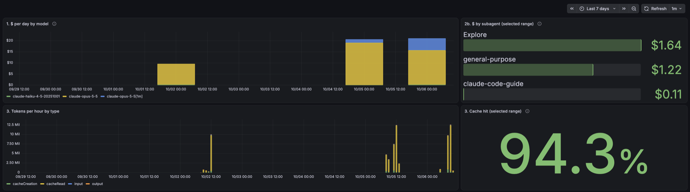

# claude-config

My global Claude Code setup, in two layers: this shareable repository (instructions, permission rules, hooks, a skill, telemetry) and a private one with personal preferences and memory, merged on top by one bash script.

- **Guard hooks.** `guard_bash.py` reads each Bash command the way the shell would (after unquoting, only the parts that actually run) and denies `rm` outside the project and `/tmp`, force-push, `curl … | sh` and skipped git hooks. Deny rules in `settings.base.json` are the hard boundary behind it.
- **Supply-chain gate.** `dep_gate.py` vets a package before the agent adds it: missing from the registry (likely hallucinated), an OSV `MAL-*` advisory or a typosquat → deny; brand-new or barely downloaded → ask. `dep_audit.py` audits the lockfile right after an install.
- **Telemetry.** A local OpenTelemetry stack and a Grafana dashboard for cost, tokens, cache hit, edit decisions and gate blocks.
- **Tests** for all of it, with no network and no real `HOME` (see [Tests](#tests)).

## Agent usage & cost dashboard



```bash
cd observability
read -rs P && printf 'GF_SECURITY_ADMIN_PASSWORD=%s\n' "$P" > .env && unset P && chmod 600 .env
docker compose up -d
open http://127.0.0.1:3000
```

Then point Claude Code at `localhost:4317` with the `env` block from [observability/README.md](observability/README.md); it works only in user settings.

Two things building it taught me:

- **Plain `increase()` overstates short sessions, so the panels use `increase(…[range] anchored)`.** `increase()` takes the first and last sample in the window and extrapolates outward, by up to half the sample interval at each end when a series starts or stops inside the window. A session that lives for a few 10-second export intervals gains a large share of its lifetime from that padding. In one test session it reported $0.0387 against an actual $0.0259 (+49%); the anchored range, which does not extrapolate, matched exactly. That is a single measurement: the size of the error depends on session length.
- **`session.id` has to stay on the metrics,** even though dropping it is the usual cardinality advice. Every CLI process keeps its own cumulative counters from zero, so without the label concurrent sessions write into the same series and overwrite each other.

Privacy: the collector deletes `user.id`, `user.email`, `user.account_uuid`, `user.account_id` and `organization.id` from metrics and events before anything is stored. Prompts, model responses and tool output are not exported (`OTEL_LOG_USER_PROMPTS` and the like are never set). Tool parameters, such as full Bash commands, are, which is why every port binds to 127.0.0.1 and nothing leaves the machine.

## The config tool

A versioned global layer for Claude Code: instructions, settings, skills and hooks that apply to every repository on a machine, kept in git and connected to `~/.claude` with symlinks.

It is meant to be shared. Anything personal — your language and style preferences, memory, plugins, connectors, private skills — lives in a second, private repository (called `claude-personal` below) that this tool layers on top.

## How it works

```text
            push                pull --ff-only          symlinks / apply
~/dev/<repo>  ──────►  hub (git remote)  ──────►  ~/tools/<repo>  ──────►  ~/.claude, ~/.config/claude-kit
working copy                                     live clone
```

- **Working copies** in `~/dev` are where you edit. Nothing there is live.
- **Live clones** in `~/tools` are what Claude Code actually reads. Every symlink points into `~/tools/*`, never into `~/dev`, so an edit takes effect only after it was committed, checked by gitleaks, pushed and pulled.
- **The hub** is any git remote (for example two private GitHub repositories).
- `~/.claude/settings.json` is never a symlink: Claude Code writes to it itself, and an atomic write would replace a symlink with a plain file. `claude-config apply` builds it from layers instead.

## Layout

| Path | What |
| --- | --- |
| `bin/claude-config` | the tool: bash 3.2 and `jq` |
| `global/CLAUDE.md` | general instructions for any developer → `~/.claude/CLAUDE.md` |
| `global/settings.base.json` | base settings layer: permission rules for secrets and destructive commands, hooks from `claude-kit` |
| `global/skills/<name>/` | general skills → `~/.claude/skills/<name>` |
| `claude-kit/hooks/` | hooks → `~/.config/claude-kit/hooks` (see below) |
| `claude-kit/statusline.sh` | two-line coloured status line: dir, branch with staged/modified/untracked counts, model, effort; context bar against `autoCompactWindow` (full = compaction; yellow/red from 60/80%), prompt cache, session $, 5h limit, duration → `~/.config/claude-kit/statusline.sh` |
| `observability/` | optional local OpenTelemetry stack (collector, Prometheus, Loki, Grafana) for Claude Code's metrics and events |
| `profiles/base/links.txt` | manifest: what gets linked where |
| `tests/` | `run.sh` (the tool), `test_*.py` (hooks, status line), `integration.sh` (real `claude` against a fake API) |

The private repository needs only two files to plug in: `links.txt` (its own manifest, same format) and `settings.personal.json` (its settings layer). Typical content: `rules/personal.md` (picked up from `~/.claude/rules/`), `memory/`, `writing/`, private `skills/` and `agents/`.

## Settings layers

`~/.claude/settings.json` = **base** (`global/settings.base.json`) → **personal** (`claude-personal/settings.personal.json`) → **machine** (`~/.claude/settings.machine.json`, not in git).

| Kind of value | How layers combine |
| --- | --- |
| objects | merged recursively |
| scalars | the later layer wins |
| `permissions.allow` / `ask` / `deny` | united |
| `hooks.<Event>` | united, without duplicates (same matcher and commands) |
| other arrays | the later layer replaces |

**Deny rules are only ever added.** `apply` and `pull` refuse (exit 3) to drop a deny rule that is live now, whichever layer it came from. To remove one on purpose: delete it from the layer and by hand from the live file, check `claude-config diff`, then `claude-config apply --discard-live`.

## Commands

| Command | What it does | Writes to |
| --- | --- | --- |
| `status` | state of every link and of `settings.json` | nothing |
| `diff` | differences between the repos and the live config | nothing |
| `link` | creates the symlinks from both manifests | `~/.claude`, `~/.config/claude-kit`, backups |
| `apply` | builds `settings.json` from the three layers | `~/.claude/settings.json`, backup, snapshot |
| `pull` | moves what Claude Code wrote by itself into the personal layer (or base if there is no personal repo); `--relink` restores a replaced link | the live clone |
| `unlink` | replaces symlinks with real copies | `~/.claude` |
| `sync` | the only way changes travel: see below | repos, hub, `~/.claude` |
| `install` | sets up a new machine | `~/dev`, `~/tools`, `~/.claude` |

`--dry-run` shows what `link`, `apply`, `pull` and `unlink` would do. Exit codes: `0` fine, `1` differences found, `2` usage or manifest error, `3` refused by an invariant.

Link states: `OK`, `REPLACED` (a plain file where the link was), `MISSING`, `FOREIGN` (points elsewhere), `SRC-MISSING`, `ORPHAN` (points into a repo but is no longer in a manifest — remove it by hand). Settings states: `in sync`, `pending` (repos ahead; run `apply`), `drift` (changed outside the tool; `diff`, then `pull`), `deny-loss`, `is-symlink`, `invalid`, `missing`.

### sync

1. **Live clones**: uncommitted changes (memory or writing the agent added through the symlinks) → show the diff → ask → gitleaks → commit → push.
2. **Working copies**: require a clean tree → show the commits the hub does not have → ask → gitleaks → push. A copy that is merely behind is left alone; a diverged one stops the run.
3. **Live clones** → `git pull --ff-only`.
4. `link` + `apply`.

Nothing is committed or pushed without consent: `--yes` gives it, a terminal asks, otherwise `sync` only prints the plan and exits 1. If gitleaks reports anything, the run stops and nothing is pushed.

## Install on a new machine

Requirements: git, `jq`, bash, gitleaks. For the hooks: Python 3.9+ (3.11+ to vet `pyproject.toml` edits); `pnpm`/`npm` and optionally `osv-scanner` for dependency audits.

```bash
git clone <hub>/claude-config.git ~/dev/claude-config
~/dev/claude-config/bin/claude-config install \
  --config-remote <hub>/claude-config.git \
  --personal-remote <hub>/claude-personal.git
```

`install` clones both repositories into `~/dev` (working copies) and `~/tools` (live clones), then runs `link` and `apply`. An existing file in `~/.claude` that differs from the repo stops `link`; run `claude-config pull` or move it away first. Restart Claude Code sessions afterwards: hooks and settings are read at session start.

## Daily workflow

- Change something general: edit in `~/dev/claude-config`, run the tests, commit, then `claude-config sync`.
- Change something personal: the same in `~/dev/claude-personal`.
- Claude Code changed `settings.json` (a plugin enabled, an "always allow"): `claude-config pull`, review the personal repo's diff, then `sync`.
- The SessionStart hook `personal_dirty` reminds you when the live personal clone has uncommitted changes.

### Adding a skill

Put it in `global/skills/<name>/SKILL.md` (general) or in the personal repo's `skills/<name>/`, add a line to the matching manifest, commit, `sync`.

### Adding a hook

Put the script in `claude-kit/hooks/`, write tests first (`tests/test_<hook>.py` for Python hooks, a case in `tests/run.sh` for shell ones), wire it in `global/settings.base.json` with an explicit `timeout`, commit, `sync`. Hooks fail open on malformed input; deny and sandbox rules are the hard boundary.

## Hooks in claude-kit

| Hook | Event | What it does |
| --- | --- | --- |
| `guard_bash.py` | PreToolUse (Bash) | denies `rm` on dangerous targets, force-push, `curl … \| sh`, skipping git hooks, disk wipes; asks before hard resets, destructive SQL, infrastructure destroy; logs blocks to `.claude/lessons/blocked.md` |
| `dep_gate.py` | PreToolUse (Bash; Edit/Write/MultiEdit on manifests) | vets packages before they are added: missing from the registry (likely hallucinated) → deny; OSV `MAL-*` → deny; typosquat of a popular package → deny; very new or barely downloaded, custom registry, registry unreachable → ask. Never answers "allow" |
| `dep_audit.py` | PostToolUse (Bash) | after packages are added: `pnpm audit` / `npm audit` / `osv-scanner` on the lockfile and deprecated npm packages → findings back to the agent |
| `personal_dirty.sh` | SessionStart | one sentence when the live personal clone has uncommitted changes |

## Safety rules

- Deny rules are only ever added; removing one is a deliberate manual step.
- gitleaks runs before every commit and push that `sync` makes; a finding stops everything.
- Nothing is committed or pushed without consent.
- Symlinks point only into the live clones in `~/tools`; the tool refuses a live root inside `~/dev`.
- Every file the tool replaces is backed up to `~/.local/state/claude-config/backups/<timestamp>/`; nothing is ever backed up inside `~/.claude` (a copy of a skill directory there would load as a second skill).
- This repository must stay free of personal data: no names, emails, employer, machine paths or project names. Those belong in the personal repository.

## Tests

```bash
tests/run.sh                                        # the tool: temporary HOME, local bare repos instead of a hub
python3 -m unittest discover -s tests -p 'test_*.py'  # hooks: registries, OSV and audit tools replaced by fixtures
FAKE_UPSTREAM=<path to fake_anthropic.py> tests/integration.sh   # real claude against a fake Messages API
```

Neither suite touches the real HOME or the network.

## Provenance

`claude-kit/` and parts of `global/` come from an earlier research project of mine, built with the help of Claude, and were then adapted and extended here (for example, `guard_bash` was rewritten to check only the executable parts of a command). The `dep_gate` and `dep_audit` hooks (on top of the kit's shared `_common.py` helpers), the `claude-config` CLI and the observability stack were written for this setup; the early commits of the hooks and the CLI stay in the private repository this one was split from. The whole repository is licensed under MIT (see LICENSE).
